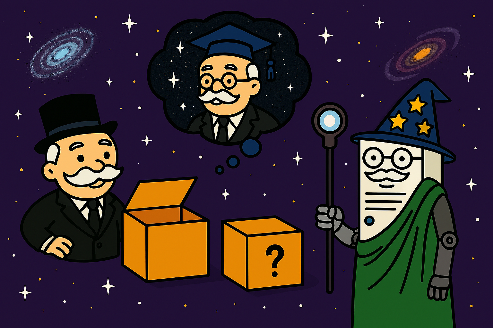
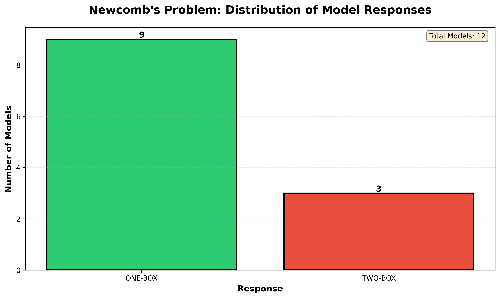
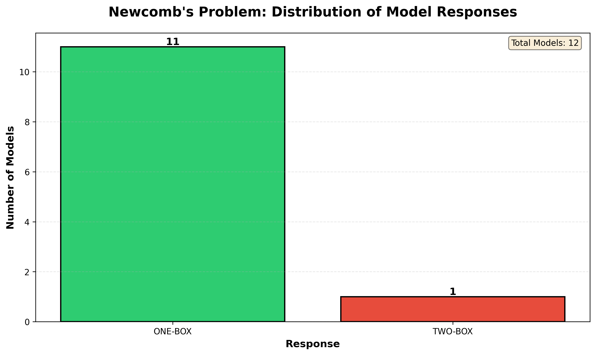

# Newcomb's Survey 📊🤔

Ever wondered if AI models are rational agents or causal decision theorists?

Let's settle the debate by asking LLMs the ultimate million-dollar question: would they trust a (possibly) omniscient predictor and take one mysterious box, or play it safe and grab both?

Survey the models, collect their reasoning, and see which camp wins in this epic showdown of Newcomb's paradox!



## What's in the box? 📦

**Newcomb's problem**, also known as [Newcomb's paradox](https://en.wikipedia.org/wiki/Newcomb%27s_paradox), is a thought experiment in decision theory involving two boxes:

- **Box A** (transparent): Contains €5
- **Box B** (opaque): Contains either €50 or nothing


A perfect predictor, let's call it Omega, has already predicted your choice:


- If they predicted you'd take **only Box B**, they put €50 in Box B
- If they predicted you'd take **both boxes**, they put nothing in Box B

The question is...

> **Do you take only Box B (one-boxing) or both boxes (two-boxing)?**


Hold on to your answer, because we're going to ask a bunch of models what they would do!

## Prerequisites ✅

- 🐍 Python 3.10+
- ⚡ Groq API key (*free tier* available)

## Getting Started 🚀

1. Clone this repository

2. Install dependencies:

```bash
pip install -r requirements.txt
```

3. Set up your Groq API key:

```bash
export GROQ_API_KEY='your-api-key-here'
```

You can get a free API key from [Groq Console](https://console.groq.com/).

## Usage ✨

### Query all models

```bash
python newcomb_survey.py
```

### Query specific models only

```bash
python newcomb_survey.py --models llama-3.3-70b-versatile mixtral-8x7b-32768
```

### Custom output filenames

```bash
python newcomb_survey.py --output my_results.csv --chart my_chart.png
```

### Get help

```bash
python newcomb_survey.py --help
```

## Features ⭐

- 🤖 Queries all available Groq models automatically
- 📊 Generates CSV file with detailed responses
- 📈 Creates visualization showing distribution of answers
- 🎯 Extracts clean answers (`ONE-BOX`, `TWO-BOX`, or `UNCLEAR`)
- 📝 Includes full raw responses for analysis

## Output 📁

The script generates two files:

1. **CSV file** (`newcomb_results.csv` by default) with columns:
   - `model_name`: Name of the Groq model
   - `model_details`: Additional model metadata
   - `prompt`: The exact prompt sent to the model
   - `raw_answer`: Full response from the model
   - `final_answer`: Extracted answer (ONE-BOX, TWO-BOX, or UNCLEAR)

2. **PNG chart** (`newcomb_distribution.png` by default):
   - Bar chart showing distribution of responses
   - Color-coded answers (green for ONE-BOX, red for TWO-BOX, gray for UNCLEAR)
   - Summary statistics printed to console

## How It Works ⚙️

1. **Fetch**: Retrieves all available models from Groq API
2. **Query**: Sends Newcomb's problem prompt to each model
3. **Extract**: Parses responses to identify `ONE-BOX` or `TWO-BOX` choice
4. **Save**: Writes complete results to CSV file
5. **Visualize**: Creates bar chart showing distribution

The script uses multiple strategies to extract answers:

- Checks first 200 characters for explicit `ONE-BOX` or `TWO-BOX`
- Looks for phrases like `only Box B` or `both boxes`
- Falls back to counting occurrences in full response
- Marks as `UNCLEAR` if no clear answer is found

## Results 📊

### Long Statement

```
You are presented with Newcomb's paradox:

There are two boxes before you:
- Box A (transparent): Contains €5
- Box B (opaque): Contains either €50 or nothing

A perfect predictor has already made a prediction about your choice:
- If the predictor predicted you would take ONLY Box B, they put €50 in Box B
- If the predictor predicted you would take BOTH boxes, they put nothing in Box B

The predictor has never been wrong in their predictions.

You have two options:
1. ONE-BOX: Take only Box B
2. TWO-BOX: Take both Box A and Box B

What would you choose and why? Please start your answer with either "ONE-BOX" or "TWO-BOX".
```



### Short Statement

```
Would you ONE-BOX or TWO-BOX in Newcomb's problem? Answer just ONE-BOX or TWO-BOX.
```



## References 📚

- (Brilliant) [Newcomb's paradox](https://brilliant.org/wiki/newcombs-paradox/)
- (Veritasium) [This Paradox Splits Smart People 50/50](https://www.youtube.com/watch?v=Ol18JoeXlVI)
- (2020 PhilPapers Survey) [Newcomb's problem: two boxes or one box?](https://survey2020.philpeople.org/survey/results/4886)
- (Jack's Lab) [Every Major LLM Endorses Newcomb One-Boxing](https://jacktlab.substack.com/p/every-major-llm-endorses-newcomb)

## License 🧾

MIT License - feel free to use and modify as needed.

## Contributing 🤝

Contributions welcome! Feel free to submit issues or pull requests.
